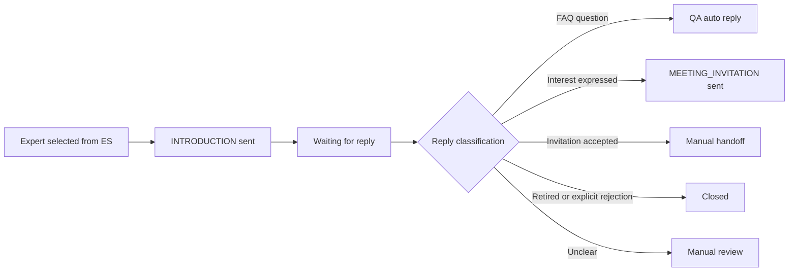

# Talent Introduction System Design

## Goal

Build a Spring Boot service that:

1. searches expert candidates from Elasticsearch;
2. sends a fixed English introduction email;
3. receives expert replies automatically;
4. replies to English questions by matching configurable QA rules;
5. sends a fixed meeting invitation email when the expert shows interest;
6. transfers the conversation to manual handling once the expert accepts the invitation.

## Data Ownership

### Elasticsearch

Use Elasticsearch for layered expert profile data.

- Level 3 raw index: original expert data. Current source index: `orcid_info`
- Level 2 candidate index: initially validated experts. These experts can receive the first introduction email.
- Level 1 application index: experts who have replied. This is the active application layer.
- Relevant fields: `orcidId`, `email`, `givenNames`, `familyNames`, `country`, `keyword`, `employment`, `age`, `degree`
- MySQL remains the transactional source of campaign, mail and conversation state.
- Index promotion rules are explicit: level 3 to level 2 after initial validity checks; level 2 to level 1 after reply receipt.

Level 2 candidate index eligibility:

- doctoral degree filtering is configurable and currently disabled because the raw index does not contain a reliable degree field yet;
- not Chinese nationality, currently judged by `country`;
- has a valid email address.
- age filtering is configurable and currently disabled by default because the raw index may not contain reliable age data yet. When enabled, the default upper bound is under 70 years old.

These filter rules must be configurable later from the admin page. The current implementation keeps them in application configuration first, then can move the same fields into MySQL-backed page configuration.

### MySQL

Use MySQL for transactional business data.

- sender accounts
- fixed mail templates
- QA categories and rules
- outreach campaigns
- expert contact state
- sent and received mail records
- manual handoff records

### Corporate Mailbox

The sender mailbox is expected to be a corporate address such as `chenjj@qftechtalent.com`.

- Sender identity and protocol credentials are stored in MySQL.
- Accounts are managed as a sender account pool.
- Account selection uses strategy weight and usage counters to avoid hot mailbox accounts.
- Account-expert assignment must also keep expert distribution balanced across accounts.
- The first balancing dimension is `country`; the design keeps the dimension extensible for research keywords or other segments.
- Each account has a daily send limit and daily sent counter.
- The first version keeps SMTP and IMAP host/port values configurable per account.
- Live sending and receiving require the actual provider settings before integration can be completed.
- The current domain mail routing resolves to a corporate-mail provider, so provider-specific host and authorization settings should be confirmed before enabling live delivery.

## Fixed Mail Templates

### `INTRODUCTION`

Supports:

- `${senderEmail}`
- `${senderName}`
- `${senderTitle}`
- `${teamName}`
- `${countryName}`

### `MEETING_INVITATION`

Supports:

- `${senderDisplayName}`

Templates are stored in MySQL from the first version. A template-management UI is deferred.

## Conversation Flow

## Conversation States

- `NEW`
- `INTRO_SENT`
- `WAITING_REPLY`
- `QA_AUTO_REPLIED`
- `MEETING_INVITATION_SENT`
- `WAITING_MEETING_CONFIRMATION`
- `MANUAL_HANDOFF`
- `MANUAL_REVIEW`
- `CLOSED`

## QA Strategy

The provided workbook `QA.xlsm` currently acts as an answer bank. The first implementation converts it into keyword-driven English QA rules.

Initial categories:

- `PROJECT_CONTENT`
- `ENTRY_FORMAT`
- `APPLYING_CRITERIA`
- `ROLE`
- `DUTY_AND_RIGHT`
- `FULL_TIME_PART_TIME`
- `WORKPLACE`
- `SALARY`
- `PROJECT_STREAM`
- `DEADLINE`
- `OUR_ADVANTAGE`
- `RETIRED`

Rules are stored in MySQL and matched in priority order. Unmatched or risky replies are routed to manual review.

## First Version Scope

Included:

- Spring Boot service skeleton
- MySQL schema and seed data
- fixed template storage
- QA rule storage
- core domain services for template rendering and QA matching
- expert search service for Elasticsearch
- sender-account service and introduction-mail composition
- weighted sender-account selection
- layered expert index configuration
- initial outreach batch service: reads level 2 candidates, assigns sender accounts, sends `INTRODUCTION`, and records contact/mail state
- automatic mail receiving service: fetches unread messages from IMAP, stores inbound messages, matches QA rules, and sends QA replies when safe

Deferred:

- admin UI
- semantic AI classification

## Known Follow-ups

- Fill real sender account credentials.
- Confirm the final English wording of QA answers before enabling automatic replies.
- Define explicit rules for interest, acceptance, rejection, and manual-review detection.
