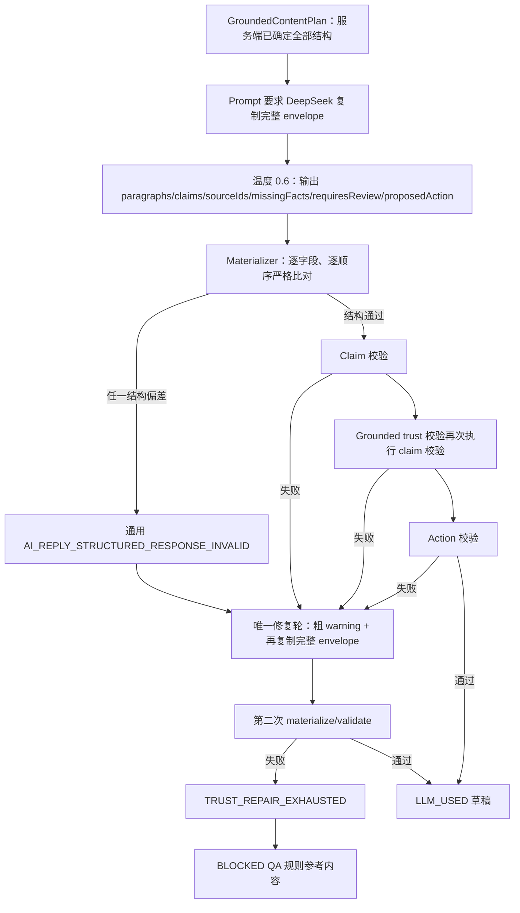
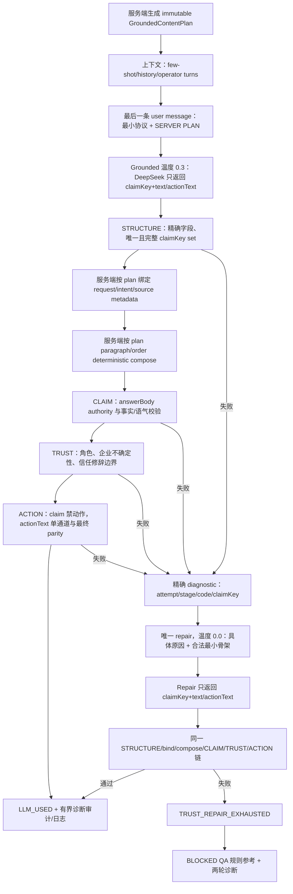

# AI Grounded 回复：服务端持有结构信封与精确修复诊断

- 日期：2026-07-27
- 状态：`READY_FOR_REVIEW`
- 类型：根因修复开发计划
- 执行边界：本文件只定义实现与验收；当前步骤不修改产品代码
- 目标现象：降低 `DeepSeek 返回内容未通过结构与可信边界校验` 的非业务性失败，同时保持现有 fail-closed、事实来源、动作和人工发送边界

## 需求描述

当前 QA_GROUNDED/QA_MATCHED 链路要求 DeepSeek 同时生成自然语言和复制服务端已经确定的结构字段：`paragraphs`、claim metadata、`sourceIds`、`missingFacts`、`requiresReview`、`proposedAction`。这些字段中只要发生数组重排、元数据格式偏差、字段增减或动作包装偏差，整份候选就被归入通用结构失败；修复轮只收到粗粒度 warning code，再次复写整份复杂 JSON。结果是：事实内容本身可能可用，仍频繁耗尽唯一修复轮，最终向操作端显示不可采用的 QA 规则参考内容。

本计划把“确定性结构”与“概率性自然语言”拆开：

1. 服务端继续生成并持有 immutable `GroundedContentPlan`，负责 request/intent/source/paragraph/missingFacts/requiresReview/action policy 和最终顺序。
2. LLM 只返回每个 `claimKey` 的自然化文本及独立 `actionText`；不再复制服务端元数据。
3. 服务端按 exact unique claim-key set 绑定文本到 plan，再执行 claim、trust、action 校验和 deterministic composer。
4. 首轮失败产生稳定、分层、可定位且不含正文的诊断；唯一修复轮只修失败候选，收到精确原因与合法最小骨架。
5. 校验耗尽仍返回 `BLOCKED` QA 参考内容；不得通过放宽事实、可信或动作门禁换取成功率。
6. 初始 grounded 调用使用低随机度，修复调用使用确定性温度；FREE_FORM 现有温度不变。
7. 初始草稿审计新增一个有界诊断对象；所有 grounded 生成路径输出安全结构化日志，支持按 attempt/stage/code 统计失败，不记录模型 raw response、邮件正文、prompt 或 QA 事实正文。

可观察结果：

- 模型仅改变 claims 数组顺序时，候选可被服务端按 plan 顺序安全组装，不触发修复。
- 模型漏 claim、重复 claim、输出未知 claim、编造高风险事实、强化条件语气或生成未授权动作时，仍严格失败；修复轮能获得具体 stage/code/claimKey。
- 修复成功时结果为 `LLM_USED`，同时保留首轮失败诊断供审计；修复再次失败时仍为 `FALLBACK_NO_RESPONSE/BLOCKED`，并保留两轮诊断。
- 三个生产入口继续共享 `AiReplyDraftService.generate()`；训练模拟、人工工作台、Grounded 自动 decision 的业务边界不分叉。

不在本计划范围：

- 不修改 QA 规则表、`answerBody`、关键词、reply policy、迁移或管理页面。
- 不修改 `HttpLlmDraftClient`、provider model id、JSON response-format seam、单次/总 TTL、重试上限、取消、SSE 进度或 generation registry。
- 不修改 fallback 的固定 QA 参考文案、人工采用门禁或最终人工发送规则。
- 不增加第二次 trust repair，不增加自动发送权限，不将历史邮件提升为事实来源。
- 不把模型 raw response、失败句子、邮件正文、prompt、QA `answerBody` 写入日志或 `operator_action_log`。
- 不以降低 strict claim/trust/action 校验、删除高风险规则或允许部分 claim set 作为成功策略。

基线证据（2026-07-27，产品改动前）：

- 定向 Maven 命令通过：215 tests，0 failures，0 errors，0 skipped。
- 同一 Maven 生命周期执行 Node 测试：373 passed，0 failed。
- 定向 Kotlin 分布：`AiReplyDraftServiceTest` 154、`AiReplyReviewAuditServiceTest` 4、`AiReplyGroundedDraftMaterializerTest` 20、`AiReplyHighRiskClaimValidatorTest` 37。
- 本地 MySQL 未运行，无法从本地库量化线上各 warning code 的真实占比；因此本计划先补无敏感内容的稳定诊断，发布后再按 code 观测，而不把未经数据支持的频率猜测写入产品规则。

## 关键不变量

### Invariant I-1：确定性信封只由服务端持有

- Rule：`requestIndex`、`intentKey`、`sourceIds`、paragraph grouping/order、missingFacts、requiresReview、allowedActions 全部来自当前请求唯一的 immutable `GroundedContentPlan`；LLM 不得返回、覆盖或重排这些字段。
- Applies to：grounded prompt、JSON materializer、composer、repair prompt。
- Violation consequence：概率输出继续决定事实归属或审核状态，结构抖动和越权元数据再次出现。
- 来源：K-grounded-json-materialize-before-policy、K-grounded-natural-structure-server-gate、K-request-facts-not-flat-pool。

### Invariant I-2：模型输出保持最小、精确协议

- Rule：top-level 字段严格为 `claims` 与 `actionText`；每个 claim 字段严格为 `claimKey` 与 `text`。禁止 Markdown fence、未知字段、空文本、内部 status token 和 explanation wrapper。
- Applies to：初始/修复 system prompt、materializer exact-field validation。
- Violation consequence：未定义字段被静默忽略，或 internal plan/status 泄漏进正文。
- 来源：K-grounding-status-ui-only、K-grounded-json-materialize-before-policy。

### Invariant I-3：claim 集合精确，数组顺序不具 authority

- Rule：模型 claimKey 必须 nonblank、唯一、全部属于 plan，且集合与 `plan.claims` 完全相等；模型数组顺序不参与输出顺序。绑定后由服务端按 plan claim/paragraph 顺序组装。
- Applies to：materializer parse/bind、`ValidatedSection` 构造、composer 输入。
- Violation consequence：允许缺 claim 会静默丢事实；依赖模型顺序会让确定性 plan 再次失效。
- 来源：K-grounded-paragraph-cap-never-drop-claims、修订后的 K-grounded-json-paragraph-order。

### Invariant I-4：事实 authority 与 claim 校验不变

- Rule：claim source 只读取当前 plan 绑定的 enabled/nonblank `qa_rule.answer_body`；`replyBody/templateBody`、mail history、operatorTurns、模型声明的 source 不得成为 authority。数字/URL、modality、高风险 family、角色披露、企业不确定性规则保持 fail-closed。
- Applies to：materializer binding、`AiReplyHighRiskClaimValidator`、repository reads。
- Violation consequence：为减少结构失败而扩大事实来源，生成未经审核内容。
- 来源：K-answerbody-source-exclusive、K-grounded-answerbody-no-legacy-fallback、K-high-risk-phrase-family-symmetric-match、K-ai-reply-modality-plain-will。

### Invariant I-5：动作只有独立单通道

- Rule：claim text 中不得出现 outbound action；动作只能出现在 `actionText`。`actionText=null` 表示无动作；非空时必须被 `AiReplyActionPolicy.detectActions()` 精确识别为一个 action，且属于 `plan.allowedActions`。composer 后正文动作集合必须与该 action 一致。
- Applies to：materializer、action policy、composer、final sanitizer。
- Violation consequence：模型把未授权请求藏进事实段，或声明与正文动作不一致。
- 来源：K-grounded-action-violation-must-retry、K-grounded-proposed-action-body-parity、K-ai-reply-action-cta-variant-coverage。

### Invariant I-6：校验阶段只执行一次且顺序固定

- Rule：每个候选严格执行 `STRUCTURE/bind → deterministic compose → CLAIM → TRUST → ACTION/final parity`；`validateGroundedCandidate()` 不得再次调用 `validate()`，同一 claim 不重复读取 source 或重复生成 warning。
- Applies to：`materializeAndValidateGroundedCandidate()`、`AiReplyHighRiskClaimValidator`。
- Violation consequence：诊断重复、数据库读取放大、修复原因不稳定。
- 来源：现状代码审计、K-grounded-json-materialize-before-policy。

### Invariant I-7：诊断稳定、可定位、有界、无敏感内容

- Rule：诊断仅含 `attempt`、`stage`、稳定 `code`、可选 `claimKey`；禁止 raw response、claim text、action text、邮件正文、prompt、source text、异常堆栈。单结果最多保留 20 条，按首次出现顺序去重；总数和 truncated 标记只在一个 audit 对象内表达。
- Applies to：结果 DTO、service log、repair prompt selector、audit snapshot。
- Violation consequence：无法量化根因，或诊断反而成为正文/事实泄漏通道。
- 来源：K-review-event-audit-payload-bounds、K-ai-generation-observability-not-send-gate。

### Invariant I-8：唯一修复轮只修具体失败

- Rule：首轮失败后最多一次 repair；repair message 包含稳定 diagnostics、对应的修复说明、允许字段和由当前 plan 生成的合法 claimKey 骨架。不得回显 raw response，不得要求再次复制 deterministic envelope。
- Applies to：`buildTrustCorrectionMessage()`、第二次 observed JSON 调用。
- Violation consequence：粗粒度“重写整份 JSON”继续产生相同结构错误，或多次重试突破总预算。
- 来源：K-grounded-action-violation-must-retry、K-validation-exhaustion-must-block-readiness。

### Invariant I-9：随机度按任务分离

- Rule：grounded 首轮使用 `LlmProperties.temperature`（当前默认 0.3）；grounded repair 固定使用 `0.0`；FREE_FORM 继续使用 `freeFormTemperature`（当前默认 0.6）。不得新增配置双写或改变 QA_MATCHED/QA_GROUNDED 的 provider model 映射。
- Applies to：`AiReplyDraftService.generateGrounded()` 两次 client 调用与 FREE_FORM 分支。
- Violation consequence：结构化修复继续受自然化温度扰动，或无关 FREE_FORM 文风发生变化。
- 来源：K-reply-model-stable-enum-mapping、现状配置审计。

### Invariant I-10：最终协议消息拥有最后指令位置

- Rule：few-shot、mail history、first-turn instruction、operatorTurns 仅提供连续性上下文；包含最小响应协议和当前 SERVER PLAN 的 user message 必须是初始 grounded messages 的最后一条。repair messages 的最后一条必须是精确诊断和合法骨架。
- Applies to：`buildGroundedMessages()`、repair message assembly。
- Violation consequence：历史/操作指令覆盖响应格式，造成结构失败或把历史内容误当 authority。
- 来源：K-ai-reply-history-continuity-not-authority、K-ai-reply-prompt-content-version-single-snapshot。

### Invariant I-11：失败与自动发送继续 fail-closed

- Rule：任一校验失败都保留既有 aggregate `contextWarnings`；repair 再失败增加 `TRUST_REPAIR_EXHAUSTED`，返回固定 QA 参考、`usedLlm=false`、`generationState=FALLBACK_NO_RESPONSE`、`draftReadiness=BLOCKED`。自动 decision 仍只依赖既有通用 warnings/readiness，不消费诊断详情放宽门禁。
- Applies to：fallback result、`GroundedAutoReplyDecisionService.hasValidationFailure()`、workbench adoption。
- Violation consequence：诊断重构意外让失败候选进入自动或人工采用路径。
- 来源：K-validation-exhaustion-must-block-readiness、K-free-form-fallback-nonempty、K-ai-generation-observability-not-send-gate。

### Invariant I-12：三个入口和窄 LLM seam 不分叉

- Rule：训练模拟、未匹配邮件工作台 JSON/SSE、Grounded 自动 decision 继续调用同一 `AiReplyDraftService.generate()`；仍通过 `chatWithModelObservedJson` 和稳定业务模型枚举访问 provider。不得在 controller 或 auto service 复制 prompt/materializer。
- Applies to：`AiTrainingController`、`UnmatchedInboundMailController`、`GroundedAutoReplyDecisionService`、`LlmDraftClient`。
- Violation consequence：一个入口修复、另一个入口继续旧协议，或扩改全局 LLM seam。
- 来源：K-ai-generate-single-freeform-seam、K-reply-model-stable-enum-mapping。

### Invariant I-13：TTL、取消、流式进度与发送边界不变

- Rule：单次/总 TTL、transport retry、cancellation token、provider-call progress、SSE generation lifecycle 和人工最终发送规则不因本计划改变。repair 固定 0.0 仍受当前剩余总预算约束。
- Applies to：`callObserved()`、generation budget、controllers、manual send services。
- Violation consequence：内容根因修复引入超时/取消回归，或生成状态升级为发送 authority。
- 来源：K-ai-generation-observability-not-send-gate、现有 streaming dual-TTL plan。

### Invariant I-14：共享审计只新增一个向后兼容字段

- Rule：`operator_action_log.after_value` 只新增 top-level `validationDiagnostics` 对象；对象内含 `items/total/truncated`。schema version 升为 `ai-reply-draft-audit-v2`；已有 warning/evidence/coverage 字段语义不变，generic map readers 必须能忽略新字段；审计写失败仍 fail-open。
- Applies to：`AiReplyReviewAuditService`、`QaRuleAuditService` 和 generic audit readers。
- Violation consequence：共享 JSON store 被无限扩张、旧读取方失败，或日志写入阻断草稿生成。
- 来源：K-review-event-audit-payload-bounds、K-ai-generation-observability-not-send-gate。

## 现状审计

### 当前处理流程



根因不是单一 DeepSeek 故障，而是协议责任分配错误：模型被要求重建服务端已有的确定性对象；严格门禁把结构复写噪声和真实可信风险都压成少量通用 warning；修复轮缺少可操作定位信息。

### Grounded generation 内存模型与调用顺序

- `GroundedContentPlan` 已包含 claims、paragraphs、missingFacts、requiresReview、allowedActions；它已经足以决定最终 envelope 和输出顺序。
- `AiReplyGroundedDraftMaterializer.parseUnifiedJson()` 当前仍要求 top-level exact fields：`paragraphs/claims/missingFacts/proposedAction/requiresReview`。
- 每个模型 claim 当前必须复制 `claimKey/requestIndex/intentKey/text/sourceIds`；paragraphs、missingFacts 和 requiresReview 也必须与 plan 精确一致。
- `AiReplyDraftService.materializeAndValidateGroundedCandidate()` 先调用 `claimValidator.validate()`；随后 `validateGroundedCandidate()` 内部再次调用 `validate()`，形成重复 claim/source validation。
- 初始失败只把 warning code 列给 `buildTrustCorrectionMessage()`；结构失败没有字段、claim 或 stage 信息。
- 初始和修复 grounded 调用都走 `properties.freeFormTemperature`，当前默认 0.6。
- `buildGroundedMessages()` 当前先加入 SERVER PLAN，再追加 operator instruction/turns；最终 user message可能来自历史操作指令而不是响应协议。

### QA 事实存储的完整写读路径

- Schema：`qa_rule.answer_body` 由 V79 增加并为非空；`reply_policy` 由 V80 增加。本计划不变更 schema。
- Runtime write paths：`QaRuleManagementService.createRule/updateRule/deleteRule/setRuleEnabled` 经 repository 写入。
- Migration write paths：V3/V17/V18/V38/V41/V44/V46/V52/V57/V63/V68/V77/V79/V80/V81 的 seed/alter/update。已应用 migration 不修改。
- Generation read paths：`QaFactSelectionService`、`AiReplyDraftService.buildGroundedUserContent/buildGroundedPlanSection`、`AiReplyHighRiskClaimValidator.resolveSourceText`、`AiReplyPointByPointComposer`。
- Interaction point：本计划只减少模型需要复制的 source metadata；服务端 sourceIds 与 `answerBody` authority 不变，不引入新 writer。

### 草稿审计共享存储的完整写读路径

- Schema：`operator_action_log.after_value` 为 TEXT，`AiReplyReviewAuditService.recordInitialDraft()` 写 JSON map；当前 schema version 为 `ai-reply-draft-audit-v1`。
- AI draft write path：工作台非 continuation 的初始生成调用 `recordInitialDraft()`；continuation 当前不写该初始草稿事件。本计划保持该语义。
- 其他 write paths：campaign service、mail send/reply service、bounce controller 通过 `OperatorActionLogService.record()` 写其他 action 类型；本计划不修改这些 writer。
- Read paths：`OperatorActionLogRepository` 的 search/count/latest，通用 audit controllers 的 raw response，`QaRuleAuditService` 的 action/field map 解析。
- Compatibility：现有 reader 按 generic map 取已知 key，未发现 exact-field schema parser；新增一个 top-level 对象可向后兼容。执行时仍须用回归测试锁定未知字段可忽略。
- Interaction point：initial repaired-success 也应记录首轮 diagnostics；initial repair-exhausted 记录两轮 diagnostics。continuation 通过安全结构化 service log 观测，不改变现有 audit event 数量。

### 三个生产入口与控制面

1. `AiTrainingController.simulate`：调用 `generate()`，operatorTurns 为空；不写初始工作台审计。
2. `UnmatchedInboundMailController.executeAiReplyTurn`：JSON/SSE 共用生成，支持 operatorTurns、dual TTL、cancel、progress；只对非 continuation 记录 initial audit。
3. `GroundedAutoReplyDecisionService.decide`：调用 `generate()`；`hasValidationFailure()` 根据 aggregate warning/readiness fail-closed。

共享 client seam 为 `LlmDraftClient.chatWithModelObservedJson()` 及 streaming 对应实现；`jsonOutput=true` 由 HTTP client 发送 JSON response format。本计划不修改该接口或 provider transport。

### 当前 warning 与可观测性缺口

- `AiReplyGroundedDraftMaterializer` 的大多数结构错误折叠为 `AI_REPLY_STRUCTURED_RESPONSE_INVALID`。
- claim/trust/action warnings 能表达风险 family，但无法稳定表达 attempt、stage 和具体 claimKey。
- `AiReplyAuditSnapshot` 只保存 warningCodes；无法区分“首轮失败后修复成功”和“修复轮再次失败”。
- 不应通过记录 raw model response 弥补缺口；可观测性只需要有限、稳定、无正文的诊断维度。

## 实现方案

### 修改后处理流程



### T1：先用失败测试锁定新协议和旧安全边界

- 文件：
  - `src/test/kotlin/com/weibo/talentintroduction/llm/service/AiReplyGroundedDraftMaterializerTest.kt`
  - `src/test/kotlin/com/weibo/talentintroduction/llm/service/AiReplyHighRiskClaimValidatorTest.kt`
  - `src/test/kotlin/com/weibo/talentintroduction/llm/service/AiReplyDraftServiceTest.kt`
  - `src/test/kotlin/com/weibo/talentintroduction/llm/service/AiReplyReviewAuditServiceTest.kt`
  - `src/test/kotlin/com/weibo/talentintroduction/mail/service/GroundedAutoReplyDecisionServiceTest.kt`
- 先把所有成功 fixture 从旧 envelope 改为最小协议，但在产品实现未改时确认测试失败，证明测试确实命中新 contract。
- materializer 红测覆盖：claims 重排可接受并由 plan 排序；missing/extra/duplicate/unknown claimKey 拒绝；top-level/claim extra field 拒绝；blank/internal token/Markdown fence 拒绝；actionText null、合法单动作、未授权动作、不可识别动作、claim 内藏动作。
- validator 红测覆盖：claim warning 带精确 claimKey 与 CLAIM stage；trust warning 带精确 claimKey 与 TRUST stage；同一候选 claim validation 只执行一次；answerBody unavailable 仍失败。
- DraftService 红测覆盖：首轮 grounded 温度 0.3、repair 0.0、FREE_FORM 0.6；最终 protocol 是最后一条 user message；repair prompt 有 exact diagnostic 和 plan skeleton，无 raw candidate；repair success/repair exhausted diagnostics lineage；TTL/cancel/transport retry 断言保持。
- audit 红测覆盖：v2 的唯一新增 top-level 字段、20 条上限、total/truncated、稳定 key、无正文；audit writer 异常仍不影响返回。
- auto decision 红测覆盖：新的 diagnostic 存在不改变 decision，现有 aggregate structure/trust/action warning 和 repair exhausted 仍拒绝自动回复。

### T2：新增共享、无正文的诊断值对象

- 新文件：`src/main/kotlin/com/weibo/talentintroduction/llm/service/AiReplyValidationDiagnostic.kt`。
- 定义：

```kotlin
enum class AiReplyValidationAttempt { INITIAL, REPAIR }
enum class AiReplyValidationStage { STRUCTURE, CLAIM, TRUST, ACTION }

data class AiReplyValidationIssue(
    val stage: AiReplyValidationStage,
    val code: String,
    val claimKey: String? = null
)

data class AiReplyValidationDiagnostic(
    val attempt: AiReplyValidationAttempt,
    val stage: AiReplyValidationStage,
    val code: String,
    val claimKey: String? = null
)

data class AiReplyValidationDiagnostics(
    val items: List<AiReplyValidationDiagnostic> = emptyList(),
    val total: Int = 0,
    val truncated: Boolean = false
)
```

- `Issue` 是单候选内部结果；DraftService 在候选所属 attempt 已知时转换为 `Diagnostic`。
- `Diagnostics` 是单次生成结果的有界 envelope；统一 factory 对 `(attempt, stage, code, claimKey)` 稳定去重、保留首次出现顺序，`items` 最多 20 条，同时保留裁剪前 `total` 与 `truncated`。claimKey 只允许 plan key；unknown-key 诊断允许保留模型 key，但进入 envelope 前截为 120 字符。
- 新增 stable code 固定为：

| Code | 条件 | claimKey |
|---|---|---|
| `AI_REPLY_STRUCTURE_JSON_INVALID` | 空、fence、非 JSON、非 object | null |
| `AI_REPLY_STRUCTURE_TOP_LEVEL_FIELDS_INVALID` | top-level 不是 exact `claims/actionText` | null |
| `AI_REPLY_STRUCTURE_CLAIMS_INVALID` | claims 不是 array | null |
| `AI_REPLY_STRUCTURE_CLAIM_FIELDS_INVALID` | claim 不是 object 或字段不精确 | 可解析时带 key，否则 null |
| `AI_REPLY_STRUCTURE_CLAIM_KEY_DUPLICATE` | 同 key 多次 | duplicate key |
| `AI_REPLY_STRUCTURE_CLAIM_KEY_UNKNOWN` | key 不在 plan | unknown key，审计前截断 |
| `AI_REPLY_STRUCTURE_CLAIM_SET_MISMATCH` | plan key 缺失或总集合不等 | 首个缺失 key；无可定位时 null |
| `AI_REPLY_STRUCTURE_CLAIM_TEXT_INVALID` | text 非 string、blank 或含内部 token | claim key |
| `AI_REPLY_ACTION_TEXT_INVALID` | actionText 既非 null 也非 nonblank string，或无法识别为单 action | null |
| `AI_REPLY_ACTION_NOT_ALLOWED` | actionText 检出的 action 不在 plan allowedActions | null |
| `AI_REPLY_ACTION_BODY_MISMATCH` | compose 后 action 集合与 actionText 不一致 | null |

- 保留既有 `AI_REPLY_STRUCTURED_RESPONSE_INVALID` 作为 aggregate `contextWarnings`，不要求 UI 和 auto decision 识别上述细码。

### T3：Materializer 只解析模型内容并绑定服务端 plan

- 文件：`src/main/kotlin/com/weibo/talentintroduction/llm/service/AiReplyGroundedDraftMaterializer.kt`。
- 新响应契约：

```json
{
  "claims": [
    {
      "claimKey": "r1:company.legal_name",
      "text": "The programme is operated by the entity stated in the reviewed rule fact."
    }
  ],
  "actionText": null
}
```

- 删除模型侧 `paragraphs/missingFacts/requiresReview/requestIndex/intentKey/sourceIds/proposedAction.type` 的解析与相等性比较；不删除 `GroundedContentPlan` 中对应字段。
- `parseClaims()` 两阶段执行：先验证 JSON shape/key uniqueness/exact set；全部通过后，按 `plan.claims` 顺序把模型 text 绑定到 plan 的 requestIndex/intentKey/sourceIds，构造 `claimTexts` 和 `ValidatedSection`。禁止边解析边产生部分可用结果。
- claims JSON 数组顺序不具语义；`ValidatedSection`、composer 和最终正文顺序只来自 plan。
- 每条 claim text 在绑定时拒绝内部 status token，并执行 action-channel 检查；命中 action 时返回 ACTION issue 和该 claimKey，不把违规句放入 issue。
- `actionText` 为空时无动作；非空时必须 detect 出 exact singleton action 且在 allowedActions。compose 后再检查 body action set 与 actionText action set 一致。
- `MaterializedDraft` 增加 `issues: List<AiReplyValidationIssue>`；`warningCodes` 继续输出 aggregate compatibility warnings。invalid 结果的 `text` 始终为空；raw JSON 永不进入 result。

### T4：Claim 与 trust 校验拆层且消除重复执行

- 文件：`src/main/kotlin/com/weibo/talentintroduction/llm/service/AiReplyHighRiskClaimValidator.kt`。
- `ClaimValidationResult` 增加 `issues: List<AiReplyValidationIssue> = emptyList()`，保留 `valid/warningCodes` 兼容现有 plain-text 调用。
- `validate(sections, requestFacts)` 对每条 answer 使用 `r<requestIndex>:<intentKey>` 定位 CLAIM issue；warningCodes 继续 distinct，issues 按 claim 保留定位后再有界去重。
- `validateGroundedCandidate()` 改为只执行 candidate-level TRUST 规则，不再内部调用 `validate()`。角色披露/企业不确定性关联到当前 claimKey；整封 trust rhetoric/confidentiality substitute 的 claimKey 为 null。
- `requestFacts` 参数仅在规则确实读取时保留；若 implementation 证明 trust-only 方法不再需要，允许从 `GroundedCandidateInput` 删除该字段，但不得改变外部 DTO/API。
- source resolution 继续仅取 enabled/nonblank answerBody；source unavailable 仍是失败，不从 replyBody fallback。
- DraftService 严格顺序调用一次 claim validation、一次 trust validation；action violations 转换为 ACTION issues。

### T5：重构 Grounded prompt、温度、修复和结果 lineage

- 文件：`src/main/kotlin/com/weibo/talentintroduction/llm/service/AiReplyDraftService.kt`。
- `AiReplyDraftResult` 增加 `validationDiagnostics: AiReplyValidationDiagnostics = AiReplyValidationDiagnostics()`；现有构造方通过默认值兼容。
- `GroundedValidationResult` 增加 `issues`；`materializeAndValidateGroundedCandidate()` 只返回当前候选问题，不附 attempt。
- 温度合同：
  - QA_GROUNDED/QA_MATCHED initial JSON call：`properties.temperature`。
  - repair JSON call：private constant `GROUNDED_REPAIR_TEMPERATURE = 0.0`。
  - FREE_FORM：`properties.freeFormTemperature`。
- `buildGroundedSystemPrompt()` 改成最小协议；明确 server plan metadata 不得复制、claims 可任意 JSON 数组顺序但 key set 必须 exact、action 单通道。
- 拆分现有 `buildGroundedUserContent()`：context message 只保留 current inbound/profile/history/context warnings，不再内嵌 plan；`buildGroundedProtocolMessage(plan)` 持有本次唯一 SERVER PLAN snapshot，避免同一请求出现两个 plan 副本。
- `buildGroundedMessages()` 先放 system/few-shot/current inbound context/first-turn instruction/operatorTurns，再追加 `buildGroundedProtocolMessage(plan)` 作为最后 user message。该消息只包含最小 JSON contract、允许动作和当前 plan；历史上下文不进入 plan。
- `buildTrustCorrectionMessage(issues, plan)` 按 code 映射具体修复句，并附 exact 合法骨架：每个 plan claimKey 恰好一次、text 留作模型重写、`actionText` 默认为 null。不得包含上次 raw response。
- lineage：
  1. initial failure issues 转为 `attempt=INITIAL`。
  2. repair success 仍把 INITIAL diagnostics 放进成功 result/audit。
  3. repair validation failure 增加 `attempt=REPAIR` diagnostics，并保留 INITIAL。
  4. repair transport failure保留 INITIAL diagnostics；transport 类 warning 继续只走 contextWarnings，不伪造成 validation stage。
  5. initial success、FREE_FORM、非校验 fallback diagnostics 为空。
- 每次候选失败写一条安全结构化 info/warn 日志，只输出 selectedModel、mode、attempt、stage/code/claimKey 列表和 truncated；不输出异常 message、raw response、messages 或 plan fact text。
- `buildGroundedResult()` 和 `groundedFallbackResult()` 接收 diagnostics 并写入 result；existing contextWarnings、readiness、generationState、fallback 文案和 evidence snapshot 保持。
- 最终 sanitizer 仍是 defense-in-depth；若它意外移除动作，维持 `NEEDS_REVIEW` 和既有 warning，不把 sanitizer 当作接受失败候选的通道。

### T6：以一个有界对象扩展初始草稿审计

- 文件：`src/main/kotlin/com/weibo/talentintroduction/llm/service/AiReplyReviewAuditService.kt`。
- `AiReplyAuditSnapshot` 新增一个字段：

```kotlin
val validationDiagnostics: Map<String, Any?>
```

- 值固定为：

```json
{
  "items": [
    {
      "attempt": "INITIAL",
      "stage": "STRUCTURE",
      "code": "AI_REPLY_STRUCTURE_CLAIM_SET_MISMATCH",
      "claimKey": "r2:finance.arrangements"
    }
  ],
  "total": 1,
  "truncated": false
}
```

- audit 对象直接投影 result 的有界 envelope；`items` 最多 20 条，item exact keys 为 attempt/stage/code/claimKey，claimKey 缺失时写 null；code/claimKey 分别截到 200/120 字符。`total` 使用裁剪前去重后的数量。
- `afterMap` 只新增 top-level `validationDiagnostics`；schema version 升为 `ai-reply-draft-audit-v2`。不新增独立 total/truncated top-level 字段。
- 保留 draftHash，不持久化 draftText；保留现有 try/catch fail-open。
- 用 generic map reader regression 证明 v1 已知字段读取不受 v2 额外对象影响；不修改数据库 schema 或其他 action writer。

### T7：锁定自动 decision 与跨入口兼容

- 文件：`src/test/kotlin/com/weibo/talentintroduction/mail/service/GroundedAutoReplyDecisionServiceTest.kt`。
- 增加 repaired-success fixture：result 带 INITIAL diagnostics、无 aggregate failure warning、readiness READY 时，decision 与现有成功行为一致；diagnostics 本身不是拒绝或放行 authority。
- 增加 repair-exhausted fixture：带 `AI_REPLY_STRUCTURED_RESPONSE_INVALID/TRUST_REPAIR_EXHAUSTED` 和两轮 diagnostics 时仍 fail-closed。
- 不修改 `GroundedAutoReplyDecisionService.kt`，除非新测试证明诊断字段默认值造成编译级机械适配；若需要改变 decision 语义，停止执行并修订计划。
- 训练和工作台入口通过 `AiReplyDraftServiceTest` 的共用 public generate contract 与全量 controller suite 回归；不得在 controller 新建协议实现。

### T8：验证顺序与停止条件

1. 先运行五个定向测试类，确认新 contract 测试在旧实现上失败。
2. 按 T2→T6 实现，每完成一层运行对应测试类。
3. 运行五类定向回归，要求全绿。
4. 运行完整 Maven test；该项目 Maven 生命周期会执行现有 Node 测试，要求 Kotlin/Node 均无新增失败。
5. 运行 `git diff --check`，审计 diff 只包含本计划 10 个产品/测试文件及计划执行流程允许的知识文档更新。

停止并修订计划的条件：

- 需要修改 `HttpLlmDraftClient`、controller、前端、QA schema/数据或第 11 个产品/测试文件。
- 需要允许缺失 claim、关闭 high-risk/modality/action validator 或增加第二次 repair 才能通过。
- audit reader 存在未审计到的 exact v1 schema parser，不能忽略新字段。
- provider 不接受 temperature 0.0；此时先保留 0.3 并记录证据，不擅自新增配置。
- 完整测试暴露与本协议无直接依赖的既有失败；不得顺手修复。

## 变更文件清单

| # | 文件 | 变更 |
|---|---|---|
| 1 | `src/main/kotlin/com/weibo/talentintroduction/llm/service/AiReplyValidationDiagnostic.kt` | 新增 attempt/stage/issue/diagnostic 稳定值对象与有界去重规则 |
| 2 | `src/main/kotlin/com/weibo/talentintroduction/llm/service/AiReplyGroundedDraftMaterializer.kt` | 最小响应协议、exact claim-set binding、action 单通道、结构诊断 |
| 3 | `src/main/kotlin/com/weibo/talentintroduction/llm/service/AiReplyHighRiskClaimValidator.kt` | claim/trust 分层诊断并消除重复 claim validation |
| 4 | `src/main/kotlin/com/weibo/talentintroduction/llm/service/AiReplyDraftService.kt` | 最终协议消息、温度分离、精确 repair、diagnostic lineage 与安全日志 |
| 5 | `src/main/kotlin/com/weibo/talentintroduction/llm/service/AiReplyReviewAuditService.kt` | audit v2 单字段有界 diagnostics 对象 |
| 6 | `src/test/kotlin/com/weibo/talentintroduction/llm/service/AiReplyGroundedDraftMaterializerTest.kt` | 最小 JSON、claim set/order、action channel、结构 code 测试 |
| 7 | `src/test/kotlin/com/weibo/talentintroduction/llm/service/AiReplyHighRiskClaimValidatorTest.kt` | claimKey/stage 定位、answerBody authority、单次执行测试 |
| 8 | `src/test/kotlin/com/weibo/talentintroduction/llm/service/AiReplyDraftServiceTest.kt` | prompt order、温度、repair lineage、fallback、TTL/cancel 回归 |
| 9 | `src/test/kotlin/com/weibo/talentintroduction/llm/service/AiReplyReviewAuditServiceTest.kt` | v2 schema、有界/截断/无正文、fail-open 测试 |
| 10 | `src/test/kotlin/com/weibo/talentintroduction/mail/service/GroundedAutoReplyDecisionServiceTest.kt` | repaired success 与 repair exhausted fail-closed 回归 |

边界：10 个文件，2 个子系统（grounded generation/validation、draft audit/auto gate），0 个数据库 migration，0 个共享表字段，1 个 `operator_action_log.after_value` 新 top-level JSON 字段，0 个 controller/frontend/provider transport 文件。执行中超出边界必须先修订并重新批准计划。

## 验收标准

- I-1/I-2：所有初始与 repair provider fixture 仅发送/接收 `claims/actionText` contract；prompt 不要求模型输出 deterministic envelope；旧 envelope 因 extra fields 被明确拒绝，避免双协议长期共存。
- I-3：claims 重排测试通过且最终正文逐字按 plan 顺序；missing/extra/duplicate/unknown 四类全部失败，不产生部分正文。
- I-4：数字/URL、modality strengthening、高风险 family、source unavailable、角色披露、企业不确定性既有正负用例全部通过；任何读取 replyBody 的 fixture 均失败。
- I-5：claim 内动作必失败并带 claimKey；actionText 的 null/合法/未授权/多动作/不可识别/body mismatch 分支全覆盖。
- I-6：单候选 claim validator spy/counter 恰好一次；warning/issue 无重复，阶段顺序固定。
- I-7：每个 diagnostic exact 4 字段，最多 20 条；日志和 audit snapshot 搜索不到 raw candidate、draftText、mail body、prompt、answerBody fixture token。
- I-8：首轮结构/claim/trust/action 各至少一例收到对应具体 repair instruction；始终最多一次 repair；repair prompt 无旧 raw response。
- I-9：captured client calls 严格断言 grounded initial=0.3、repair=0.0、FREE_FORM=0.6；模型枚举/provider id 断言不变。
- I-10：有 first-turn instruction 和两个 operatorTurns 时，initial messages 最后一条仍是 protocol+SERVER PLAN；history 仅作 continuity，不改变 claim set/sourceIds。
- I-11：repair success 为 `LLM_USED` 且保留 INITIAL diagnostics；repair failure 为 `FALLBACK_NO_RESPONSE/BLOCKED`、固定 QA 参考、含 `TRUST_REPAIR_EXHAUSTED` 和 INITIAL/REPAIR diagnostics；fallback 不可采用。
- I-12：训练模拟、工作台 JSON/SSE、auto decision 全量既有测试无回归；无 controller/client 新协议分支。
- I-13：单次/总 TTL、transport retry、cancel、progress 测试保持通过；repair 不突破剩余总预算；人工发送测试不读取 validationDiagnostics。
- I-14：audit after_value schemaVersion 为 v2，只有一个新增 top-level key；旧字段逐值不变，generic reader 忽略新字段，writer 异常仍返回 snapshot/result。
- 编译与定向测试：

```bash
JAVA_HOME=/Library/Java/JavaVirtualMachines/zulu-11.jdk/Contents/Home \
PATH=/Library/Java/JavaVirtualMachines/zulu-11.jdk/Contents/Home/bin:$PATH \
mvn test -Dtest=AiReplyGroundedDraftMaterializerTest,AiReplyHighRiskClaimValidatorTest,AiReplyDraftServiceTest,AiReplyReviewAuditServiceTest,GroundedAutoReplyDecisionServiceTest
```

- 完整回归与静态检查：

```bash
JAVA_HOME=/Library/Java/JavaVirtualMachines/zulu-11.jdk/Contents/Home \
PATH=/Library/Java/JavaVirtualMachines/zulu-11.jdk/Contents/Home/bin:$PATH \
mvn test

git diff --check
```

## 人工验收清单

### A-1：正常多问题首轮生成

- 前置条件：准备至少 3 个 grounded claim、2 个 paragraph、无 outbound action；stub/provider 返回最小协议且 claims 故意乱序。
- 操作步骤：从未匹配邮件工作台发起首次生成；查看草稿、问题依据和 audit event。
- 预期结果：只调用一次 LLM；草稿按服务端 plan 顺序，不按模型数组顺序；结果可采用；audit diagnostics total=0。
- 覆盖：I-1、I-2、I-3、I-12。

### A-2：首轮漏 claim 后精确修复成功

- 前置条件：首轮漏掉第二个 claim；repair 返回 exact claim set。
- 操作步骤：生成草稿并捕获两次 provider request 与最终 audit。
- 预期结果：首轮被拒绝且无部分正文；repair 最后一条消息包含 `STRUCTURE/AI_REPLY_STRUCTURE_CLAIM_SET_MISMATCH/缺失 claimKey` 和完整最小骨架；第二轮成功；最终为 LLM_USED，audit 保留 INITIAL diagnostic。
- 覆盖：I-3、I-7、I-8、I-11、I-14。

### A-3：claim 重排不触发无意义 repair

- 前置条件：模型返回 exact claim set，但 JSON array 顺序与 plan 相反。
- 操作步骤：生成并检查 provider call count、最终段落顺序。
- 预期结果：一次调用成功；provider call count=1；最终顺序与 plan 一致。
- 覆盖：I-1、I-3。

### A-4：重复/未知/额外字段结构失败

- 前置条件：分别准备 duplicate claimKey、unknown claimKey、top-level extra field 三个 fixture；repair 仍返回同类错误。
- 操作步骤：逐一生成。
- 预期结果：每例恰好两次 provider call；diagnostic code 精确区分；最终固定 QA 参考、BLOCKED；raw JSON 不出现在响应、日志或审计。
- 覆盖：I-2、I-3、I-7、I-8、I-11。

### A-5：高风险事实和语气强化仍被拒绝

- 前置条件：QA answerBody 为条件性表述；模型分别输出保证性承诺、无来源数字/URL和未授权高风险实体声明。
- 操作步骤：生成并检查 repair 指令及最终状态。
- 预期结果：分别得到 CLAIM stage 的 modality/hallucination/high-risk code 与 claimKey；repair 只能删除或降级有问题 claim；repair 不纠正时 BLOCKED。
- 覆盖：I-4、I-6、I-7、I-8。

### A-6：动作单通道

- 前置条件：场景 allowedActions 为空；模型在 claim text 中写材料请求。另准备允许 PROPOSE_MEETING 且 actionText 合法的场景。
- 操作步骤：分别生成。
- 预期结果：claim 内动作以 ACTION stage + claimKey 拒绝；允许场景只在最终 action paragraph 出现一次 meeting action，claims 中无动作；body parity 通过。
- 覆盖：I-5。

### A-7：修复耗尽 fail-closed

- 前置条件：首轮与 repair 均输出无依据承诺。
- 操作步骤：从工作台生成并尝试采用。
- 预期结果：恰好两次 provider call；显示“LLM 生成失败”及固定 QA 规则参考；`usedLlm=false/FALLBACK_NO_RESPONSE/BLOCKED`；采用不可用；两轮 diagnostics 均在 audit 中，`TRUST_REPAIR_EXHAUSTED` 保留。
- 覆盖：I-8、I-11、I-14。

### A-8：多轮 continuation 指令优先级

- 前置条件：存在两轮 assistant/operator history，历史 operator 文本包含普通内容修改要求。
- 操作步骤：继续生成，检查发送给 provider 的 message role/order。
- 预期结果：历史内容保留；最后一条 user message始终是当前 protocol+SERVER PLAN；历史不能新增 claim/source/action；continuation 不新增 initial audit event，但 service log 有失败 code 时可观测。
- 覆盖：I-7、I-10、I-14。

### A-9：自动回复 decision 回归

- 前置条件：准备 repaired-success READY 与 repair-exhausted BLOCKED 两个 result。
- 操作步骤：运行 Grounded auto decision/preview。
- 预期结果：成功结果按既有 policy 决策；diagnostics 不独立改变决策；耗尽结果因 aggregate warnings/readiness 被拒绝。
- 覆盖：I-11、I-12。

### A-10：训练模拟与工作台 JSON/SSE 一致

- 前置条件：三入口使用同一最小 provider fixture。
- 操作步骤：调用训练 simulate、工作台 JSON、工作台 SSE result。
- 预期结果：三者都接受新协议；工作台 JSON/SSE 最终业务字段一致；无入口仍要求旧 envelope；训练模拟不写 operator action audit。
- 覆盖：I-12、I-14。

### A-11：TTL 与取消回归

- 前置条件：provider 首轮阻塞、repair 阻塞、总 TTL 即将耗尽、用户 cancel 四个 fixture。
- 操作步骤：分别触发 timeout/cancel，观察 provider 调用、progress 终态和 result。
- 预期结果：attempt/total TTL 与现有合同一致；总预算不足时不启动超预算 repair；cancel 终止 provider；无第三次调用；SSE 终态与 registry cleanup 不变。
- 覆盖：I-8、I-13。

### A-12：审计隐私与兼容

- 前置条件：使用包含唯一敏感 marker 的 mail body、QA answerBody、claim text 和 raw invalid JSON；制造超过 20 条去重 diagnostics。
- 操作步骤：读取 `operator_action_log.after_value` 与应用日志；用现有 generic audit endpoint/QA audit reader 读取同一记录。
- 预期结果：after_value 仅新增 `validationDiagnostics`；items=20、total 为完整数、truncated=true；敏感 markers 均不存在；旧 reader 正常返回既有字段；审计失败模拟不阻断草稿。
- 覆盖：I-7、I-14。
