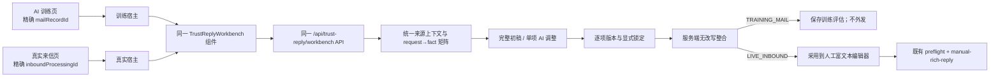

# 可信回复工作台双入口共用开发计划索引

日期：2026-07-27  
状态：待批准、待执行  
性质：非执行索引；执行以四个子计划为准

## 目标

把“AI 训练 / 历史邮件模拟回复”和“收发件箱 / 真实来信回复”收口到同一套可信回复工作台。两处只提供宿主和页面级完成动作，工作台内部 DOM、状态机、API、逐项 AI 调整、版本、锁定、整合规则完全共用。

固定产品决策：

1. 每个来信请求单独显示、单独选择处理方式、单独填写 AI 调整要求、单独生成版本并显式锁定。
2. 锁定后的条目正文逐字保留；最终整合只能按原请求顺序加入服务端 frame 和段落分隔，不得全局改写、去重、截断或重排。
3. 训练与真实回复不提供用户可切换的模式开关；页面上下文分别固定为 `TRAINING_MAIL` 与 `LIVE_INBOUND`。
4. 模拟模式永不发送；真实模式只把整合结果采用到既有人工富文本编辑器，最终发送仍走既有人工发送链路。
5. 训练评估保留，但只保存有界元数据与哈希，不保存来信正文、回复正文、逐项指令或 QA `answerBody`。

## 拆分与执行顺序

| 顺序 | 子计划 | 独立产出 | 文件数 | 子系统数 | 依赖 |
|---|---|---|---:|---:|---|
| 1 | [01 共享运行时与 API](./trusted-reply-shared-workbench-01-shared-runtime-api.md) | 双来源统一解析、统一 bootstrap/full-generate、统一 SSE/取消 | 6 | 2 | 无 |
| 2 | [02 逐项 AI、版本锁定与无改写整合](./trusted-reply-shared-workbench-02-item-lock-assembly.md) | 单项处理策略、单项 AI 版本、锁定、服务端整合 | 10 | 2 | 01 |
| 3 | [03 训练评估留存](./trusted-reply-shared-workbench-03-training-evaluation-audit.md) | 模拟结果评估写入既有操作日志 | 5 | 2 | 02 |
| 4 | [04 单一前端工作台](./trusted-reply-shared-workbench-04-single-frontend-workbench.md) | 一个组件挂载两个宿主，页面仅保留完成动作适配器 | 8 | 2 | 01、02、03 |

任何子计划未通过自身机器验收与人工验收，不进入下一子计划。四个计划全部完成后再做一次全链路验收。

## 跨计划合同

### X-1：来源身份不可降级

- `TRAINING_MAIL.sourceId` 永远表示精确 `mail_record.id`；禁止回退到联系人最新一封邮件。
- `LIVE_INBOUND.sourceId` 永远表示精确 `inbound_mail_processing.id`。
- 每次生成、单项调整、整合、训练评估都携带并复验 `sourceVersion`。

### X-2：工作台内部只有一套实现

- 前端内部渲染、事件、异步隔离、版本与锁定状态只存在于 `trust-reply-workbench.js`。
- `app.js` 只负责训练邮件选择、真实详情选择、模式固定和最终动作回调。
- 不允许在 `index.html` 或 `app.js` 再复制一份工作台内部表单。

### X-3：锁定正文逐字不变

- 最终 `rawDraftText` 中，每个未省略的锁定 `answerText` 必须按原请求顺序逐字出现且恰好一次；相同文本来自两个不同请求时必须各保留一次。
- 服务端 frame 可以位于条目前后；不得进入或改写条目正文。

### X-4：模拟与发送隔离

- 公共工作台 API 不提供发送方法。
- 模拟页完成动作只能进入训练评估。
- 真实页完成动作只能采用到人工富文本区；SMTP、`mail_record`、QA 关联和发送审计仍由既有 `/manual-rich-reply` 完成。

### X-5：证据与发送 authority 分离

- 工作台按服务端 canonical request→fact 矩阵生成与整合。
- 采用后的最终人工发送仍只依据当前最终正文、当前服务端事实和当前 sender/contact 做校验；历史生成状态、锁定状态、draft hash 和训练评估都不是发送许可。(来源: K-ai-adopt-direct-send-no-residual-gates, K-manual-rich-render-before-send)

### X-6：旧入口兼容期

- 01～03 只新增公共 API，不移除旧 `/api/ai-training/simulate` 和 `/api/mail/unmatched-inbound/{id}/ai-reply/*`。
- 04 切换前端后，旧接口进入兼容状态；删除旧接口、旧 DTO 与无调用代码另立清理计划，不混入本计划组。

## 总体数据流



## 总体验证门

四个子计划完成后执行：

```bash
JAVA_HOME=/Library/Java/JavaVirtualMachines/zulu-11.jdk/Contents/Home mvn test
node --check src/main/resources/static/trust-reply-workbench.js
node --check src/main/resources/static/app.js
node --test src/test/js/*.test.js
```

全链路必须额外证明：

1. 同一封测试来信分别通过模拟来源和真实来源 bootstrap 后，除来源类型、来源 ID、页面安全文案外，request 顺序、状态、canonical fact IDs、处理选项一致。
2. 两个入口的工作台内部 DOM 结构一致；不存在模式切换控件。
3. 修改一个条目只增加该条目的版本；其他条目正文、版本和锁定状态不变。
4. 事实集或来源版本变化后，旧版本不能整合。
5. 训练完成只能写一条 `AI_TRAINING_REPLY_EVALUATED`；真实完成只能采用到编辑器，未点击人工发送前无 SMTP、无 outbound `mail_record`。
6. 纯人工回复不依赖工作台历史，仍可直接经过既有服务端校验发送。

## 明确不纳入本计划组

- 训练评估历史列表、趋势报表、打分模型训练或自动回灌 QA。
- 跨浏览器、跨页面持久化未完成的工作台草稿。
- 多人协同编辑、服务端草稿锁、WebSocket 同步。
- 删除旧兼容 API、重命名既有 `/composed-reply/*`、调整自动回复 decision 链路。
- 改造人工富文本编辑器或最终发送审批策略。

