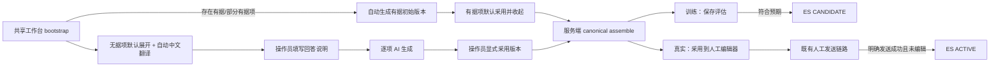

# 可信回复工作台无依据回答 V1 开发计划索引

日期：2026-07-29
状态：待批准、未执行
性质：总计划索引；实际执行以五个子计划为准

## 需求描述

在既有“训练模拟 / 真实收发共用同一可信回复工作台”的基础上，完成以下产品调整：

1. `GROUNDED/PARTIAL` 有依据项目由系统生成默认版本，默认视为已处理并收起，不要求逐项点击“锁定此版本”。
2. `UNSUPPORTED` 无依据项目默认展开；操作员填写“希望如何回答”的中文或英文说明，AI 仅依据这段说明生成面向收件人的实际回复。
3. 每一项仍可独立选择处理方式、独立填写要求、独立调用 AI、独立选择版本；调整一项不得改变其他项。
4. 无依据问题默认显示中文翻译，同时保留手动“翻译为中文 / 收起译文 / 失败重试”按钮。
5. 每个非空 AI 回答提供独立的手动中文翻译按钮；译文只用于界面辅助，不进入版本、整合、发送或 ES 文档。
6. 删除“生成全部版本”按钮；bootstrap 后仅在存在 `GROUNDED/PARTIAL` 项时自动触发一次受控完整生成，全为无据项时不做无意义的完整生成。
7. 处理方式为 `OMIT`（省略此项）时，服务端产生空版本，最终正文完全不输出该项。
8. 修复“锁定无反馈”和 `TRUST_REPLY_LOCKED_ITEM_INVALID`：界面必须立即显示采用状态；整合请求的 handling、正文、claims、模型、generationKind、版本号必须来自同一个不可变版本。
9. 新建 ES 索引保存经资格确认的无依据回答：训练侧仅保存“符合预期”的评估结果；真实侧仅在正式邮件成功发送后保存。
10. V1 不提供相似问题复用、推荐、向量检索、自动回填、编辑、删除或晋升；AI 训练只增加一个只读 Tab 查看索引列表。
11. 训练评估继续保留；训练和真实入口继续使用完全相同的工作台内部 DOM、状态机和 API，仅完成动作不同。

## 拆分与执行顺序

| 顺序 | 子计划 | 独立产出 | 文件数 | 子系统数 | 依赖 |
|---:|---|---|---:|---:|---|
| 1 | [01 后端逐项语义与版本合同](./trust-reply-unsupported-answer-v1-01-backend-item-semantics.md) | 新无依据处理方式、操作员描述生成、canonical 版本与整合校验 | 8 | 1 | 无 |
| 2 | [02 共享工作台交互与翻译](./trust-reply-unsupported-answer-v1-02-shared-workbench-ux.md) | 切换无据默认、自动初始化、有据默认收起、逐项采用、翻译、移除全量按钮 | 8 | 2 | 01 |
| 3 | [03 ES 索引与训练只读列表](./trust-reply-unsupported-answer-v1-03-es-index-training-list.md) | 新索引、幂等写接口、分页读 API、AI 训练只读 Tab | 10 | 2 | 01；可与 02 独立开发，验收时在 02 后合并 |
| 4 | [04 训练评估合格后入索引](./trust-reply-unsupported-answer-v1-04-training-qualified-archive.md) | `MEETS_EXPECTATION` 后写 `CANDIDATE` 文档 | 8 | 2 | 01、03 |
| 5 | [05 正式发送成功后入索引](./trust-reply-unsupported-answer-v1-05-live-send-qualified-archive.md) | 未编辑工作台结果发送成功后写 `ACTIVE` 文档 | 10 | 2 | 01、03；建议在 04 后执行 |

每个子计划必须先通过自身自动化验收与人工验收，才进入下一依赖阶段。不得把五个计划压成一次大改。

## 跨计划关键不变量

### X-1：工作台内部仍只有一个实现

- `src/main/resources/static/trust-reply-workbench.js` 独占工作台 DOM、逐项状态、翻译状态、生成、采用和整合请求。
- `app.js` 的训练宿主固定 `TRAINING_MAIL + SIMULATION`，真实宿主固定 `LIVE_INBOUND + LIVE`；页面不提供模式切换。
- 训练宿主只进入评估；真实宿主只采用到人工编辑器。公共组件没有发送方法。

### X-2：有依据默认采用不等于降低服务端校验

- 自动生成成功的 `GROUNDED/PARTIAL` 初始版本可由前端默认标记为 `resolvedVersionId` 并收起。
- assemble 仍重新解析当前 source/evidence/request matrix、重新计算版本 ID、重新验证 claims；source/evidence 变化时旧版本必须失败。
- 自动生成失败、缺少版本或版本不完整时不得伪装成“已处理”。

### X-3：无依据回答的 authority 明确为操作员描述

- 新 handling 固定为 `ANSWER_FROM_OPERATOR_INPUT`，只允许用于 `UNSUPPORTED`。
- `operatorInstruction` 在该 handling 下是人工提供的回答内容依据；在有据 handling 下仍只能是表达调整要求。
- AI 不得增加操作员描述中没有的具体事实；该回答仍保持 `UNSUPPORTED` 分类，不能转成 QA evidence、GROUNDED 或自动发送许可。
- 无依据版本必须显式采用；不允许自动锁定 AI 根据人工描述生成的回答。

### X-4：整合字段必须来自同一 canonical 版本

- UI 的草稿下拉值与已采用版本分离：`draftHandling` 不能覆盖已采用版本的 `handling`。
- assemble 的 `handling/answerText/claims/model/generationKind/evidenceSetVersion/sourceVersion/operatorInstruction/operatorInstructionHash/versionId` 全部从一个 `resolvedVersion` 序列化。
- 服务端根据当前 request 重新 materialize；任何混装、篡改或 hash 不符返回稳定 422，不做字段猜测或自动修复。

### X-5：省略是真正的零输出

- `OMIT` 版本固定空 `answerText`、空 `claims`、`OMITTED`；不调用 LLM。
- 最终 composer 不为该项生成标题、占位符、解释、空段落或“此项已省略”文本。
- ES 永不保存 `OMIT`。

### X-6：翻译是易失的展示状态

- 翻译统一调用既有 `POST /api/translate`，不新增翻译后端。
- 译文不改变 versionId、draftHash、assembly、训练评估快照或正式发送内容。
- 翻译失败不阻塞生成、采用、整合、评估或发送；卸载或切换来源后必须丢弃迟到结果。

### X-7：ES 只存“资格已成立”的无依据回答

| 来源 | 资格事件 | ES status | 允许写入 | 禁止写入 |
|---|---|---|---|---|
| 训练 | 评估已成功持久化且 rating=`MEETS_EXPECTATION` | `CANDIDATE` | `ANSWER_FROM_OPERATOR_INPUT` 的 canonical 非空版本 | 生成预览、失败版本、其他评分、ACK、OMIT、译文 |
| 真实 | SMTP 明确成功且 `finalizeSuccess` 已返回 outbound `mail_record.id` | `ACTIVE` | 与未编辑发送正文完全一致的 canonical 工作台版本 | 发送失败/未知、编辑后发送、纯人工回复、ACK、OMIT、译文 |

ES 写失败不得回滚已成功的训练评估或已发送邮件；响应返回独立 archive status 并记录错误。V1 不引入 outbox 或自动重试。

### X-8：索引不是 QA 知识库

- 索引使用独立物理名 `trust_reply_unsupported_answer_v1`，不写 `qa_rule`、`reply_snippet` 或专家三级索引。
- 文档中的问题、操作员描述和 AI 回答在 V1 设置 `index:false`，只通过 `_source` 列表读取；不暴露关键词搜索、similarity、vector 或 reuse API。
- 读取 Tab 只读；无编辑、删除、采用、复用按钮。

### X-9：现有发送与审计边界不变

- 训练 `operator_action_log` 继续只保存有界元数据和哈希，不保存正文或操作员描述。
- 纯人工发送不依赖工作台或 ES；AI/ES 状态不得成为 manual-rich-reply 的发送 gate。
- raw/rendered 采用边界保持：仅在编辑器 text 与 HTML 均等于采用 baseline 时携带 raw template 与 archive assembly。

## 目标数据流



## 总体 ES 文档合同

物理索引：`trust_reply_unsupported_answer_v1`；配置项：`ES_UNSUPPORTED_ANSWER_INDEX_NAME`。

文档只保存以下显式字段：

| 字段 | ES 类型 | 说明 |
|---|---|---|
| `schemaVersion` | keyword | 固定 `trust-reply-unsupported-answer-v1` |
| `status` | keyword | `CANDIDATE` / `ACTIVE` |
| `sourceMode` | keyword | `TRAINING` / `LIVE` |
| `sourceType` | keyword | `TRAINING_MAIL` / `LIVE_INBOUND` |
| `sourceId` | long | 精确 `mail_record.id` 或 `inbound_mail_processing.id` |
| `sourceVersion` | keyword | 写入时 canonical source 版本 |
| `expertContactId` | long | 当前联系人 ID |
| `campaignId` | long | 当前 campaign ID |
| `requestKey` | keyword | 工作台稳定问题键 |
| `requestIndex` | integer | 原始问题顺序 |
| `requestText` | text, `index:false` | 原始问题，不用于 V1 检索 |
| `handling` | keyword | 仅 `ANSWER_FROM_OPERATOR_INPUT` |
| `operatorInstruction` | text, `index:false` | 操作员回答说明 |
| `operatorInstructionHash` | keyword | 描述 SHA-256 |
| `versionId` | keyword | canonical 版本 ID |
| `answerText` | text, `index:false` | AI 实际回答 |
| `answerHash` | keyword | 回答 SHA-256 |
| `model` | keyword | 生成模型 |
| `generationKind` | keyword | 固定 `AI_GENERATED` |
| `qualificationType` | keyword | `TRAINING_EVALUATION` / `LIVE_SEND` |
| `qualificationId` | keyword | evaluation log ID / outbound mail_record ID |
| `approvedBy` | keyword | 操作员标识，限制长度 |
| `createdAt` | date | 资格事件时间 |

`dynamic:"strict"`。`_id = sha256(sourceType + "|" + sourceId + "|" + requestKey + "|" + versionId)`；使用 `op_type=create`，409 视为同一 canonical 版本的幂等成功。

## 总体验证门

五个子计划完成后执行：

```bash
JAVA_HOME=/Library/Java/JavaVirtualMachines/zulu-11.jdk/Contents/Home mvn test
node --check src/main/resources/static/trust-reply-workbench.js
node --check src/main/resources/static/app.js
node --test src/test/js/*.test.js
git diff --check
```

全链路必须额外证明：

1. 训练和真实入口对同一 request matrix 渲染完全相同的工作台内部结构；仅模式文案与完成回调不同。
2. 打开工作台后无“生成全部版本”按钮；有据项生成成功后自动显示“已处理”并收起，无据项保持展开。
3. 无据项输入具体说明后，LLM 请求把说明标为回答依据，返回正文包含说明要求；不再固定输出“我会核实后回复”。
4. 点击“采用此版本”后 badge、按钮、进度立即变化；整合不再因下拉值与版本混装触发 `TRUST_REPLY_LOCKED_ITEM_INVALID`。
5. `OMIT` 项在 raw/rendered 正文中无任何字符或占位。
6. 翻译失败、ES 不可用均不阻塞核心工作台；ES 不可用也不改变训练评估成功和邮件发送成功事实。
7. 训练只有 `MEETS_EXPECTATION` 写入；真实只有明确成功且未编辑的工作台结果写入。
8. AI 训练索引 Tab 可以分页、按 TRAINING/LIVE 过滤并翻译问题/回答，但没有任何编辑、删除、采用或复用操作。

## 明确不纳入 V1

- 相似度复用、关键词检索、向量 embedding、自动推荐、自动填充。
- 从索引晋升 QA、自动模型训练、自动 prompt 注入。
- 索引文档编辑、删除、人工状态迁移、批量导出。
- 若后续启用搜索/复用，另建 `v2` mapping 并从 V1 `_source` 受控 reindex；不得原地假设 `index:false` 字段可直接变为可检索。
- ES 写入 outbox、后台重试、补偿任务、历史数据回填。
- 把译文持久化到 ES，或把译文发送给收件人。
- 修改自动回复 decision 链路、人工发送审批策略、QA 事实选择规则。
- 删除旧接口或重构与本需求无关的专家三级索引。
